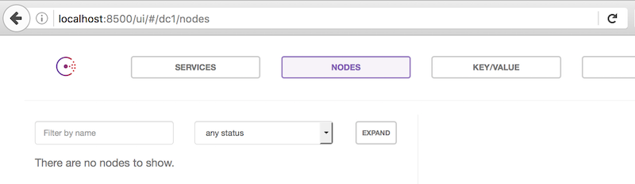
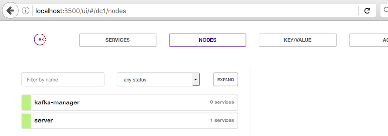

# docker-consul
[](https://imagelayers.io/?images=qnib/consul:latest 'Details')

Image to hold the consul master.

## RUN

It will provide a basic consul server which could be joined.
The Image provides (not yet) the WebUI and exposes the PORT that can be fetched by '--link'ing the container to others.

### Client only

This just runs a simple consul container.
```
$ docker run -d --name consul -h consul qnib/consul
```
It's not very useful though, because it does not start a server:

```
$ docker run -d --name consul -h consul qnib/consul
61efb47eed87a2739006126de8bc57435feab45f54e5d76ac69865d53e465a12
$ docker exec -t 61efb47eed87 consul members
Node    Address          Status  Type    Build  Protocol  DC
consul  172.17.0.3:8301  alive   client  0.6.4  2         dc1
$
```
### Server

More useful is to start a server and exposing the port of the consul WebUI. 

```
$ docker run -d --name server -h server \
                    -p 8500:8500 -e CONSUL_SERVER=true qnib/consul
```
The server comes up, but...



... as it is not bootstrapped, it does not show anything.

#### Bootstrapped Server

```
$ docker rm -f server
$ docker run -d --name server -h server -p 8500:8500 \
                         -e CONSUL_SERVER=true \
                         -e CONSUL_BOOTSTRAP=true qnib/consul
```

### Cluster

To bring container together we create a docker overlay network, which will allow to lookup the IP address of a container by its hostname or container name.

```
$ docker network create consul
cd36de2587af084000d24e6280491180baa8704b2e60739e0609686406405a32
```

Now we start the server with the additional `--net` option.

```
$ docker run -d --name server -h server -p 8500:8500 --net consul \
                         -e CONSUL_SERVER=true \
                         -e CONSUL_BOOTSTRAP=true qnib/consul
```

Which allows us to ping a container using his container-/hostname.

```
$ docker run -ti --net consul qnib/alpn-base  ping -c1 server
PING server (172.27.0.2): 56 data bytes
64 bytes from 172.27.0.2: seq=0 ttl=64 time=0.160 ms

--- server ping statistics ---
1 packets transmitted, 1 packets received, 0% packet loss
round-trip min/avg/max = 0.160/0.160/0.160 ms
$
```

Now we can start a client (any of my stack containers basically) to join the cluster.

```
$ docker run -d --name kafka-manager -h kafka-manager  \
                     -e CONSUL_CLUSTER_IPS=server \
                     --net consul qnib/kafka-manager
4276deefdb02f72072c74a81e52d900aa503eb121b95be62d1c411fa06119d08
$
```

Et voila... 


